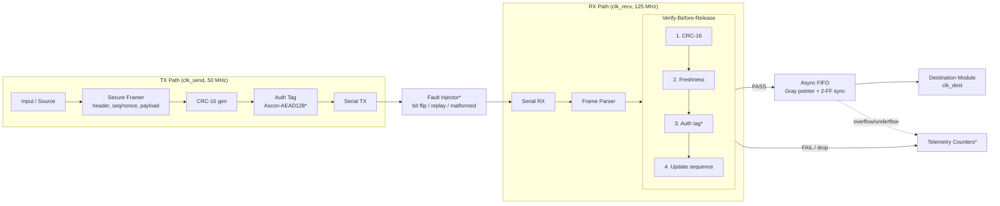

# 🛡️ Verification-First Secure Communication Wrapper

**Verification-First Secure Communication Wrapper for FPGA-Based Serial and CDC FIFO on Cyclone V SoC**

PERURI Chip Hackathon 2026 — Kategori: *IC Chip Design & FPGA Implementation*
Universitas Brawijaya · Target board: **Terasic DE10-Nano (Intel Cyclone V SoC `5CSEBA6U23I7`)**

Repositori ini berisi kode sumber VHDL purwarupa *reusable hardware security IP* untuk mengamankan komunikasi data pada perangkat *embedded* dan IoT. Konsep utamanya adalah **Verify-Before-Release**: sebuah frame tidak langsung diteruskan, tetapi harus lolos pemeriksaan CRC, authentication, dan freshness terlebih dahulu. Hanya frame yang lolos semua tahap yang boleh masuk ke *asynchronous FIFO* menuju subsistem tujuan. Frame yang gagal dibuang (*fail-closed*) dan dicatat pada telemetry counter.

---

## 📌 Latar Belakang Singkat

| Masalah | Keterbatasan pendekatan konvensional |
|---|---|
| Kesalahan transmisi | CRC dapat mendeteksi error, tetapi **tidak** memberi authentication. |
| Manipulasi & replay | Authentication saja belum cukup bila receiver tidak menyimpan state *freshness*. |
| Beban pemrosesan | Security di CPU memaksa setiap frame diproses sekuensial dan menambah latency serta beban prosesor. |
| Perpindahan antar-clock domain | Tanpa mekanisme CDC yang tepat dapat terjadi metastability, overflow, dan underflow. |

**Solusi:** security gate diletakkan di FPGA *sebelum* CDC FIFO, sehingga data yang belum terverifikasi tidak dapat mencapai destination subsystem. Pemrosesan di FPGA bersifat paralel dan *pipelined* dengan latency deterministik (jumlah clock cycle per frame tetap) serta tidak membebani CPU per frame.

---

## 📊 Status Implementasi Saat Ini

Purwarupa saat ini adalah **fondasi arsitektur CDC dan verification gate dasar**. Inti kriptografi Ascon belum diintegrasikan.

| Fitur | Status |
|---|---|
| Secure framing + CRC | ✅ Terimplementasi di RTL |
| Freshness checking | ✅ Terimplementasi di RTL (dasar) |
| FSM `security_controller` (Verify-Before-Release) | ✅ Terimplementasi di RTL |
| Asynchronous FIFO (Gray pointer) + CDC checker | ✅ Terimplementasi di RTL |
| PLL 50 → 125 MHz, top-level DE10-Nano (Switch/LED) | ✅ Terimplementasi |
| Simulasi testbench dasar (Questa) | ✅ Waveform dasar tersedia (lihat proposal, Lampiran 3) |
| **Ascon-AEAD128 core** (enkripsi/dekripsi + tag) | 🔲 Direncanakan — Bootcamp Hari 1 |
| Fault injector (bit flip, replay, malformed) | 🔲 Direncanakan — Bootcamp Hari 2 *(kontrol Switch sudah dipetakan di top-level)* |
| Telemetry counter / CSR + HPS-FPGA bridge | 🔲 Direncanakan — Bootcamp Hari 2 |
| Assertion (VHDL-2008 / PSL) & CDC verification lengkap | 🔲 Direncanakan |
| Constraint SDC untuk lintasan Gray CDC | 🔲 Direncanakan |
| Uji hardware DE10-Nano, SignalTap, benchmark | 🔲 Direncanakan — Bootcamp Hari 3 |

---

## 🏗️ Arsitektur

FPGA fabric berperan sebagai **data plane**, sedangkan HPS (ARM) sebagai **control plane** (konfigurasi parameter, key/session management, pengaturan fault injection, monitoring status melalui HPS-FPGA Bridge/CSR).


<sub>`*` = direncanakan (belum ada di repositori ini). Diagram lengkap ada pada proposal, Lampiran 1.</sub>

### FSM Verify-Before-Release

```
IDLE → CHECK_CRC → CHECK_FRESH → CHECK_TAG → UPDATE_SEQ → RELEASE → IDLE
  │         │            │            │                        │
  └─ malformed / crc_err / replay / auth_fail / fifo_full ──────┴──► DROP (counter++) → IDLE
```

Properti keamanan yang menjadi target desain:
* Frame yang belum terverifikasi **tidak boleh** menghasilkan `output_valid`.
* *Sequence state* hanya diperbarui **setelah** tag valid (mencegah replay dan *state poisoning*).
* FIFO tidak melakukan *read* saat empty atau *write* saat full.
* Frame gagal → *fail-closed* (dibuang dan dicatat).

### Fault Model
Bit flip · replay · malformed frame · FIFO overflow/underflow.

---

## 📂 Struktur Modul & Berkas (VHDL)

### 1. Top-Level & Clocking
| Berkas | Fungsi |
|---|---|
| `de10_nano_top.vhd` | Pembungkus level teratas: pemetaan pin DE10-Nano (Switch untuk kontrol fault injection, LED untuk indikator status verifikasi, Clock). |
| `top_level.vhd` | Integrasi sistem Pengirim (TX) dan Penerima (RX). |
| `pll_sys.vhd` / `pll_sys.qip` | Intel FPGA IP (PLL) untuk membangkitkan 125 MHz dari osilator 50 MHz. |

### 2. Logika Keamanan
| Berkas | Fungsi |
|---|---|
| `secure_wrapper.vhd` | Kerangka antarmuka modul keamanan *(tempat integrasi Ascon-AEAD128 nantinya)*. |
| `secure_framing.vhd` | Penyusunan paket/frame data dan CRC. |
| `security_controller.vhd` | FSM Verify-Before-Release. |

### 3. Manajemen Memori & CDC
| Berkas | Fungsi |
|---|---|
| `async_fifo.vhd` | Antrean asinkron antar clock domain (flag full/empty, deteksi overflow/underflow). |
| `gray_counter.vhd` | Penghitung Gray code untuk pointer FIFO. |
| `cdc_checker.vhd` | Pemantau stabilitas sinyal lintas clock. |

### 4. Komunikasi & I/O
| Berkas | Fungsi |
|---|---|
| `serdes_interface.vhd` | Antarmuka serializer/deserializer untuk *FPGA-based serial link*. |

> **Catatan:** DE10-Nano tidak memiliki *dedicated high-speed SerDes transceiver*, sehingga komunikasi pada purwarupa memakai serial link berbasis fabric FPGA sebagai media demonstrasi.

### Modul yang Direncanakan
`ascon_aead128_core`, `crc16_gen/chk`, `frame_parser`, `freshness_checker`, `verify_gate`, `reset_sync`, `fault_injector`, `telemetry_csr`, `top_wrapper` (integrasi Platform Designer).

---

## 🚀 Hasil Sintesis (Quartus Prime 25.1 Lite)

Target: `5CSEBA6U23I7` (Cyclone V).

> ⚠️ **Konteks pengukuran:** angka berikut disintesis dari level `top_level` dengan **input uji konstan** untuk demonstrasi fungsi dasar, dan **belum memuat Ascon-AEAD128**, fault injector, maupun telemetry. Angka ini adalah *baseline* fondasi CDC, **bukan** estimasi resource sistem final.

### Resource Usage

| Komponen | Hasil terukur | Kapasitas DE10-Nano |
|---|---|---|
| ALMs | 32 (< 1%) | 41.910 |
| Combinational ALUT | 59 | – |
| Dedicated Registers | 55 | – |
| M10K / Memory Bits | 0 / 0 | 553 / 5.662.720 |
| DSP Blocks | 0 | 112 |
| PLL | 1 (17%) | 6 |
| User I/O Pins | 15 (5%) | 314 |

Estimasi sistem final (setelah Ascon + fault injector + telemetry): LUT ≤ 60%, register ≤ 60%, M10K ≤ 70%, DSP ≤ 50%.


### Timing Analysis (Fmax)

Model: *Slow 1100mV 100C*.

| Clock domain | Fmax | Target |
|---|---|---|
| Penerima (`divclk` / `outclk_0`) | **141,06 MHz** | 125 MHz |
| Pengirim (`FPGA_CLK1_50`) | **214,22 MHz** | 50 MHz |

Kedua domain memenuhi target frekuensi pada tahap ini. Namun, untuk *timing closure* penuh pada implementasi akhir, desain masih memerlukan **constraint SDC yang komprehensif**, khususnya `set_false_path` atau `set_max_delay` pada lintasan pointer Gray CDC. Margin pada domain penerima (≈ 13%) juga akan berkurang ketika inti Ascon ditambahkan.


### Diagram RTL
Visualisasi pemisahan domain `FPGA_CLK1_50` dan `outclk_0` (125 MHz) melalui `top_level`.


---

## 🧪 Verifikasi

**Saat ini:** simulasi RTL dengan testbench VHDL konvensional di *Questa Intel FPGA Starter Edition 2025.2* (waveform dasar pada proposal, Lampiran 3).

**Direncanakan:**
* Testbench dengan clock pengirim 50 MHz dan penerima 125 MHz (rasio non-integer 2,5) untuk merepresentasikan asinkronitas ekstrem.
* Assertion VHDL-2008 / PSL, misalnya: tidak ada perubahan pointer ilegal di `gray_counter` saat FIFO full/empty; frame tak terverifikasi tidak menghasilkan `output_valid`.
* Skenario uji: frame normal, bit flip, authentication failure, replay, malformed frame, FIFO full/empty, reset, dan perpindahan antar-clock domain.
* Uji hardware di DE10-Nano: fault injection via Switch, status `crc_error` / `replay_err` / penolakan frame pada LED, serta SignalTap.
* Folder `sim/` berisi tabel hasil uji dan tangkapan waveform akan ditambahkan.

### Metrik Keberhasilan
| Aspek | Target |
|---|---|
| Keamanan | 100% rejection terhadap tampering dan replay · 0 frame tidak valid lolos ke destination · 0 assertion violation · 100% deteksi overflow/underflow |
| Performa | Latency per frame, throughput, Fmax, timing slack, resource utilization — dibandingkan dengan implementasi software referensi (Ascon-AEAD128 dalam C/Python) dan serial link berbasis CRC saja |

---

## 🗓️ Rencana & Roadmap

| Hari Bootcamp | Fokus | Target |
|---|---|---|
| **Hari 1** | Architecture & RTL Baseline | Secure frame, CRC, **Ascon-AEAD128**, freshness checker, baseline async FIFO |
| **Hari 2** | Integration & Verification | TX/RX terintegrasi, Verify-Before-Release, fault injector, telemetry, testbench, assertion |
| **Hari 3** | FPGA Implementation & Demo | Bitstream, timing/resource report, SignalTap, hardware fault injection, benchmark, demo final |

---

## 🛠️ Tools

* **Bahasa:** VHDL
* **Sintesis & timing:** Intel Quartus Prime 25.1 Lite Edition
* **Simulasi:** Questa Intel FPGA Starter Edition 2025.2
* **Integrasi HPS-FPGA (rencana):** Platform Designer (Qsys)
* **Otomasi pengujian & benchmark:** Python

## ▶️ Cara Menjalankan Kompilasi

1. Klon repositori:
   ```bash
   git clone https://github.com/SheindyAfriliaManurung/Peruri2026.git
   ```
2. Buka **Intel Quartus Prime**.
3. **File → Open Project…** lalu pilih `de10_nano_top.qpf`.
4. Di panel *Tasks*, klik dua kali **Compile Design**.
5. Setelah selesai, lihat laporan Fitter, Timing Analyzer, dan RTL Viewer.

---

## 👥 Tim

| Nama | Peran | Tanggung jawab |
|---|---|---|
| **Sheindy Afrilia Manurung** (Ketua) | Integrasi & Koordinasi | `de10_nano_top`, `top_level`, `pll_sys` |
| **Ahmadtovich Hathori Astro** | Kripto, Freshness & Kebijakan Nonce | `secure_wrapper`, `secure_framing`, `security_controller` |
| **Afifah Zuriah Mindarini** | Memori & Stabilitas CDC | `async_fifo`, `gray_counter`, `cdc_checker` |
| **Agatha Triotama** | Testbench, Laporan Quartus & Benchmark | `serdes_interface`, testbench & verifikasi, analisis Quartus, benchmark |

**Dosen Pembimbing:** Wijaya Kurniawan, S.T., M.T., Ph.D. — Universitas Brawijaya

## 📚 Referensi

1. NIST SP 800-232, *Ascon-Based Lightweight Cryptography Standards for Constrained Devices* (2025).
2. C. Dobraunig, M. Eichlseder, F. Mendel, M. Schläffer, *Ascon v1.2: Lightweight Authenticated Encryption and Hashing*, Journal of Cryptology, 2021.
3. C. E. Cummings, *Simulation and Synthesis Techniques for Asynchronous FIFO Design*, SNUG San Jose, 2002.
4. Terasic, *DE10-Nano User Manual*.
5. Intel, *Cyclone V Device Handbook* dan *Cyclone V HPS Technical Reference Manual*.
